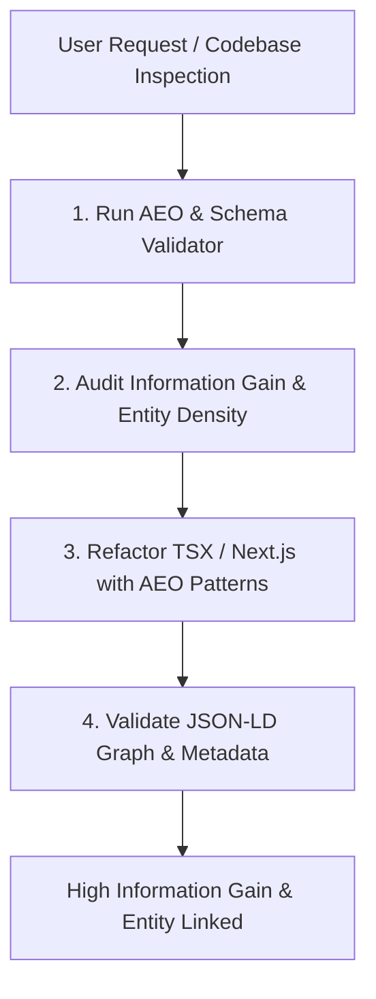

# 🤖 AEO & Schema.org Entity Architect (Generative Search & LLM Crawlers)

Use this skill whenever auditing, structuring, or coding Next.js, React, or Headless CMS web pages to optimize for **AI Answer Engines (Perplexity, ChatGPT Search, Google AI Overviews, Claude)** and generate **deterministic Schema.org JSON-LD entity graphs**.

Trigger on prompts like:
- *"Optimize this page for Perplexity / ChatGPT search / Google AI Overviews"*
- *"Generate Schema.org JSON-LD entity graph for this component"*
- *"Add AEO structured data and direct-answer summary blocks"*
- *"Audit this article for Information Gain and LLM crawler extractability"*
- *"Add TechArticle / SoftwareApplication / FAQPage structured data to Next.js"*
- *"Refactor CMS schema for entity citations and key takeaways"*

---

## 🛠️ Step-by-Step Agent Workflow

When activated, follow this deterministic 4-step loop:



1. **Step 1: Execute the AEO Schema & Information Gain Validator**
   Run the bundled deterministic validator against the target file(s) or directory:
   ```bash
   pnpm exec tsx skills/aeo-search-architect/scripts/validate-aeo-schema.ts --path <TARGET_FILE_OR_DIR>
   ```

2. **Step 2: Review AEO Diagnostics**
   Check for:
   - Missing or disconnected Schema.org JSON-LD `<script type="application/ld+json">`.
   - Absence of BLUF (Bottom Line Up Front) direct-answer summary cards.
   - Low Information Gain (narrative fluff without structured tables, `<dl>`, or key takeaways).
   - Missing `SpeakableSpecification` targeting CSS selectors.

3. **Step 3: Refactor in Place (Next.js / React 19 / CMS)**
   - Inject connected `@graph` JSON-LD payloads into Next.js Server Components.
   - Add direct-answer summary blocks with `data-speakable="true"` or matching CSS classes.
   - Replace prose-heavy descriptions with high-density comparison tables and definition lists (`<dl>`).
   - Sync `generateMetadata` OpenGraph/Twitter tags with Schema.org `@id` and canonical URLs.

4. **Step 4: Verify & Confirm Entity Linkage**
   Re-run the validator to guarantee **0 errors**, valid JSON-LD structure, and high Information Gain score.

---

## 📐 The 10 Core AEO & Schema.org Rules

### 1. `AEO-001`: Direct-Answer Summary Block (BLUF / Top 200 Tokens)
* **Principle**: AI answer engines (Perplexity, ChatGPT Search) prioritize pages that provide a concise, factual, direct answer within the first 200 tokens.
* **Requirement**: Place an upfront summary card directly under the `<h1>` with direct answer definitions and key takeaways.
* **Pattern**:
  ```tsx
  <header className="mb-8">
    <h1 className="text-3xl font-bold">{title}</h1>
    {/* BLUF Direct Answer Block */}
    <div 
      id="quick-answer"
      role="region" 
      aria-label="Key Takeaways"
      className="mt-4 p-4 rounded-xl bg-slate-50 border border-slate-200 dark:bg-slate-900 dark:border-slate-800"
    >
      <p className="font-semibold text-slate-900 dark:text-slate-100 mb-2">
        Direct Answer / Key Takeaways:
      </p>
      <ul className="list-disc pl-5 space-y-1 text-sm text-slate-700 dark:text-slate-300">
        <li><strong>Definition:</strong> Concrete, citation-ready explanation.</li>
        <li><strong>Primary Benefit:</strong> Direct metric or measurable outcome.</li>
        <li><strong>Implementation:</strong> 1-sentence actionable step.</li>
      </ul>
    </div>
  </header>
  ```

---

### 2. `AEO-002`: Nested & Connected Entity Graph (`@graph` with `@id`)
* **Principle**: Disjointed single schemas (e.g. separate Article and Person) fail to inform crawlers of entity relationships. A single connected `@graph` ties Author ➡️ Organization ➡️ Article ➡️ FAQs.
* **Requirement**: Use `@graph` array with explicit `@id` URIs cross-referencing parent and related entities.
* **Pattern**:
  ```json
  {
    "@context": "https://schema.org",
    "@graph": [
      {
        "@type": "Organization",
        "@id": "https://example.com/#organization",
        "name": "Acme Engineering",
        "url": "https://example.com"
      },
      {
        "@type": "Person",
        "@id": "https://example.com/authors/jane-doe#person",
        "name": "Jane Doe",
        "jobTitle": "Principal Systems Architect",
        "worksFor": { "@id": "https://example.com/#organization" }
      },
      {
        "@type": "TechArticle",
        "@id": "https://example.com/posts/aeo-guide#article",
        "isPartOf": { "@id": "https://example.com/#website" },
        "author": { "@id": "https://example.com/authors/jane-doe#person" },
        "publisher": { "@id": "https://example.com/#organization" },
        "headline": "Answer Engine Optimization Guide",
        "inLanguage": "en-US"
      }
    ]
  }
  ```

---

### 3. `AEO-003`: `SpeakableSpecification` Integration
* **Principle**: Google Assistant, Gemini, and LLM text extraction models use `SpeakableSpecification` to identify the exact DOM nodes to quote in voice outputs and AI summaries.
* **Requirement**: Include `speakable` property in `Article` / `TechArticle` pointing to the exact CSS selectors or element IDs containing the direct answer.
* **Pattern**:
  ```json
  "speakable": {
    "@type": "SpeakableSpecification",
    "cssSelector": ["#quick-answer", ".key-takeaways", "article > header > p"]
  }
  ```

---

### 4. `AEO-004`: `TechArticle` & `Article` Rich Metadata
* **Principle**: Standard `Article` lacks technical context. `TechArticle` provides explicit signals for technical depth, software dependencies, and developer proficiency.
* **Required Properties**:
  * `proficiencyLevel`: `"Beginner"` | `"Intermediate"` | `"Expert"`
  * `dependencies`: Software or library prerequisites (e.g., `"React 19, TypeScript 5.7"`).
  * `datePublished` & `dateModified` (ISO 8601 strings).
  * `headline` & `description`.

---

### 5. `AEO-005`: `SoftwareApplication` & `WebApplication` Technical Spec Graph
* **Principle**: SaaS products, developer tools, and web applications indexed as generic pages miss software feature comparisons in answer engines.
* **Required Properties**:
  * `applicationCategory`: e.g. `"DeveloperApplication"`, `"BusinessApplication"`
  * `operatingSystem`: e.g. `"All"`, `"macOS, Linux, Windows"`
  * `offers`: Pricing model (`price`, `priceCurrency: "USD"`).
  * `featureList`: Direct bulleted list or array of key technical capabilities.

---

### 6. `AEO-006`: `FAQPage` & `QAPage` Structured Data Binding
* **Principle**: Answer engines parse exact question-and-answer pairs into direct conversational responses.
* **Requirement**: Any page with an FAQ section must render both semantic visual elements (`<details>` / `<summary>` or `<dl>`) and matching `FAQPage` JSON-LD.
* **Pattern**:
  ```json
  {
    "@type": "FAQPage",
    "@id": "https://example.com/posts/aeo-guide#faq",
    "mainEntity": [
      {
        "@type": "Question",
        "name": "What is Answer Engine Optimization (AEO)?",
        "acceptedAnswer": {
          "@type": "Answer",
          "text": "Answer Engine Optimization (AEO) is the practice of structuring web content with Schema.org entity graphs, direct-answer summary blocks, and high Information Gain data to be cited by AI search engines."
        }
      }
    ]
  }
  ```

---

### 7. `AEO-007`: Tabular & Definition List Density
* **Principle**: LLMs favor structured Markdown/HTML tables and definition lists (`<dl>`) over multi-paragraph narrative prose when answering factual queries.
* **Requirement**: Convert comparative data, feature matrices, and technical specifications into semantic `<table>` and `<dl><dt><dd>` elements.
* **Anti-pattern**: 5 paragraphs describing differences between tool A and tool B.
* **AEO Pattern**: 1 comparison table with explicit metric columns + 1 summary sentence.

---

### 8. `AEO-008`: Next.js `generateMetadata` Coherence
* **Principle**: Discrepancies between HTML `<head>` meta tags (`og:title`, `canonical`) and Schema.org JSON-LD cause indexing ambiguity.
* **Requirement**: Use Next.js `generateMetadata` to produce matching canonical URLs, OpenGraph tags, and Twitter Cards alongside the inline JSON-LD script.
* **Pattern**:
  ```tsx
  export async function generateMetadata(): Promise<Metadata> {
    return {
      title: "Complete AEO Guide | Acme",
      description: "Direct-answer optimization and Schema.org entity graphs.",
      alternates: { canonical: "https://example.com/posts/aeo-guide" },
      openGraph: {
        title: "Complete AEO Guide",
        type: "article",
        url: "https://example.com/posts/aeo-guide",
        publishedTime: "2026-08-24T12:00:00Z",
      },
    };
  }
  ```

---

### 9. `AEO-009`: Headless CMS Schema Enrichment
* **Principle**: CMS authoring schemas must enforce AEO content fields at the editorial layer.
* **Requirement**: Enrich Sanity / Strapi / Contentful schemas with:
  * `keyTakeaways`: Array of concise factual bullet points.
  * `directAnswerSummary`: 50-word citation-ready summary.
  * `primaryEntities`: Explicit entity keywords and Wikidata / Schema.org URIs.
  * `faqItems`: Structured Question/Answer pairs.

---

### 10. `AEO-010`: Semantic HTML5 Architecture for AI Crawlers
* **Principle**: AI crawlers (`PerplexityBot`, `GPTBot`, `Google-Extended`) parse the DOM tree directly to extract core content, ignoring navigational and boilerplate noise.
* **Requirement**: Structure every page with semantic landmarks:
  * `<main id="main-content">`
  * `<article aria-labelledby="post-title">`
  * `<header>` containing `<h1>`, author attribution, and BLUF direct answer block.
  * `<section aria-labelledby="...">` for subtopics.
  * `<aside>` for supplementary links and citations.
