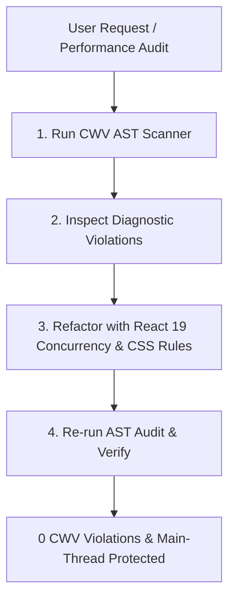

# ⚡ Core Web Vitals & INP/LCP/CLS Doctor

Use this skill whenever auditing, diagnosing, or refactoring React & Next.js applications for **Core Web Vitals performance (INP < 200ms, LCP < 2.5s, CLS < 0.1)**.

Trigger on prompts like:
- *"Fix INP / Interaction to Next Paint issues in this component"*
- *"Wrap heavy state updates in startTransition or useDeferredValue"*
- *"Eliminate layout shifts (CLS) on images/dynamic cards"*
- *"Optimize LCP hero image and priority hints"*
- *"Break up long tasks to unblock the main thread"*
- *"Audit this React component for performance bottlenecks"*

---

## 🛠️ Step-by-Step Agent Workflow

When activated, follow this deterministic 4-step loop:



1. **Step 1: Execute the CWV AST Scanner**
   Run the bundled scanner against the target file(s) or directory:
   ```bash
   pnpm exec tsx skills/cwv-inp-doctor/scripts/audit-cwv-ast.ts --path <TARGET_FILE_OR_DIR>
   ```

2. **Step 2: Inspect Exact Diagnostics**
   Check for:
   - Synchronous heavy filtering or sort operations in `onChange` / `onClick` handlers.
   - `` tags missing explicit `width`/`height` or aspect-ratio bounding containers.
   - `` elements above the fold marked with `loading="lazy"` or lacking `fetchPriority="high"`.
   - Offscreen feed items lacking CSS containment (`content-visibility: auto`).

3. **Step 3: Refactor in Place**
   - Wrap non-urgent state updates in `startTransition(() => ...)` or bind expensive derivative rendering to `useDeferredValue()`.
   - Provide explicit width/height dimensions or Tailwind aspect ratio utilities (`aspect-video`, `aspect-square`).
   - Add `fetchPriority="high"` and remove lazy loading from above-the-fold hero banners.
   - Inject `content-visibility: auto` with `contain-intrinsic-size` on long scrollable feeds.

4. **Step 4: Verify Clean Execution**
   Re-run the audit script to verify **0 errors** and confirm zero regression in type checks.

---

## 📐 The 10 Core CWV Rules

### 1. `CWV-001`: Sync Heavy Computation in Event Handlers (INP)
* **AST Detection**: `onChange`, `onInput`, or `onClick` callbacks triggering synchronous array transforms (`.filter()`, `.sort()`, `.reduce()`) combined with state setters without `startTransition` or `useDeferredValue`.
* **Fix**: Separate immediate user feedback (e.g. typing) from heavy filtering:
  ```tsx
  // Immediate input state
  const [query, setQuery] = useState('');
  // Defer heavy list computation so typing never drops frames
  const deferredQuery = useDeferredValue(query);
  const filteredItems = useMemo(() => items.filter(i => i.name.includes(deferredQuery)), [items, deferredQuery]);
  ```

---

### 2. `CWV-002`: Missing Dimensions on Media Elements (CLS)
* **AST Detection**: ``, `<video>`, or `<iframe>` JSX elements without explicit `width` & `height` attributes or without an explicit aspect-ratio CSS container.
* **Fix**: Provide explicit attributes or aspect ratio containers to reserve layout geometry before media loads:
  ```tsx
  
  ```

---

### 3. `CWV-003`: LCP Hero Asset Prioritization (LCP)
* **AST Detection**: Hero banner images containing `loading="lazy"` or lacking `fetchPriority="high"`.
* **Fix**:
  ```tsx
  
  ```

---

### 4. `CWV-004`: Non-Passive Scroll & Touch Listeners (INP / Scroll Jank)
* **AST Detection**: `addEventListener('scroll', ...)` or `addEventListener('touchstart', ...)` in `useEffect` without `{ passive: true }`.
* **Fix**: Always mark passive touch and wheel listeners so the browser thread doesn't wait for JavaScript before scrolling.

---

### 5. `CWV-005`: Layout Thrashing / Forced Reflows (INP)
* **AST Detection**: Reading layout geometry (`offsetHeight`, `clientWidth`, `getBoundingClientRect()`) immediately followed by synchronous style writes (`style.width = ...`).
* **Fix**: Batch reads first or schedule layout mutations via `requestAnimationFrame()`.

---

### 6. `CWV-006`: Large Component Code Splitting & Dynamic Imports (LCP / TBT)
* **AST Detection**: Massive dialogs, data visualization libraries, or rich text editors statically imported in initial page bundles.
* **Fix**: Use `next/dynamic` or `React.lazy` with `<Suspense fallback={...}>` to defer non-critical JS.

---

### 7. `CWV-007`: Web Font FOUT/FOIS Shift Prevention (CLS)
* **AST Detection**: Custom `@font-face` rules lacking `font-display: swap` or fallback size adjustments.
* **Fix**: Use `next/font` with `adjustFontFallback: true` or define matching fallback metric overrides (`ascent-override`, `descent-override`).

---

### 8. `CWV-008`: Long Task Scheduling & Yielding (INP)
* **AST Detection**: Synchronous loops iterating over > 500 records in event callbacks.
* **Fix**: Yield main thread execution to the browser between chunks:
  ```ts
  async function yieldToMain() {
    if ('scheduler' in window && 'yield' in (window as any).scheduler) {
      await (window as any).scheduler.yield();
    } else {
      await new Promise((resolve) => setTimeout(resolve, 0));
    }
  }
  ```

---

### 9. `CWV-009`: DOM Node Budget & Nesting Flattening
* **AST Detection**: Component trees generating deeply nested container wrappers (`div > div > div > div`) exceeding DOM tree depth guidelines (> 32 levels or > 1,500 nodes).
* **Fix**: Flatten unnecessary layout wrappers using React Fragments (`<></>`) and modern CSS grid/flexbox.

---

### 10. `CWV-010`: CSS `content-visibility` for Long Feeds (INP / Rendering)
* **AST Detection**: Virtual or long scrollable list items rendered without layout containment.
* **Fix**: Add `content-visibility: auto` and `contain-intrinsic-size` to skip offscreen element rendering until scrolled near the viewport:
  ```tsx
  <div className="[content-visibility:auto] [contain-intrinsic-size:auto_350px]">
    <FeedCard item={item} />
  </div>
  ```
