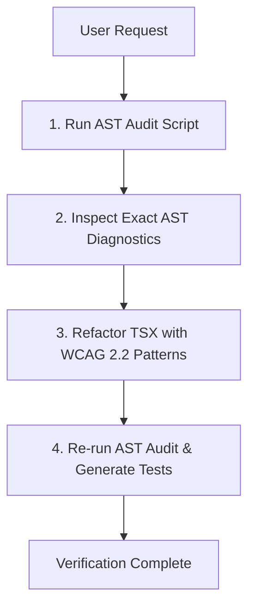

# ♿ React & TypeScript Accessibility AST Refactorer (WCAG 2.2)

Use this skill whenever auditing, refactoring, or writing React/TypeScript components that require **WCAG 2.2 accessibility compliance**, **screen reader compatibility**, **keyboard navigation**, or **ARIA state management**.

Trigger on prompts like:
- *"Audit this React component for accessibility"*
- *"Fix a11y issues in this modal/dropdown/form"*
- *"Make this WCAG 2.2 AA compliant"*
- *"Add focus trap and keyboard navigation"*
- *"Fix screen reader / ARIA labels"*

---

## 🛠️ Step-by-Step Agent Workflow

When activated, follow this deterministic 4-step loop:



1. **Step 1: Execute the AST Scanner**
   Run the bundled scanner against the target file(s) to obtain mathematical, zero-hallucination diagnostics:
   ```bash
   pnpm exec tsx skills/react-a11y-ast-refactorer/scripts/audit-a11y-ast.ts --path <TARGET_FILE_OR_DIR>
   ```

2. **Step 2: Review AST Violation Nodes**
   Map each reported line number to the corresponding AST rule below.

3. **Step 3: Refactor in Place**
   Apply the canonical React 19 / TypeScript solutions provided in the rules section. Preserve business logic, styling classes, and state management.

4. **Step 4: Verify & Generate Test Spec**
   Re-run the audit script to verify 0 remaining AST errors, and generate a Vitest / Playwright test using `scripts/generate-a11y-test.ts`.

---

## 📐 The 10 Core AST Accessibility Rules

### 1. `A11Y-001`: Non-Interactive Click Elements (`<div onClick>`)
* **AST Detection**: `JsxElement` with non-interactive tag name (`div`, `span`, `p`, `li`, `section`) containing an `onClick` attribute without `role="button"`, `tabIndex={0}`, and `onKeyDown`.
* **Fix**: Convert to a native `<button>` element whenever possible. If layout requires a `<div>`, inject:
  * `role="button"`
  * `tabIndex={0}`
  * `onKeyDown={(e) => { if (e.key === 'Enter' || e.key === ' ') { e.preventDefault(); handleClick(); } }}`

---

### 2. `A11Y-002`: Modal & Dialog Focus Trapping (WCAG 2.2 SC 2.1.2)
* **AST Detection**: Components with names containing `Modal`, `Dialog`, `Drawer`, `Popover` lacking `role="dialog"`, `aria-modal="true"`, or `aria-labelledby`.
* **Mandatory Pattern**:
  1. `role="dialog"` and `aria-modal="true"`.
  2. `aria-labelledby={titleId}` bound to the modal header.
  3. Traps keyboard `Tab` cycles within the modal boundaries.
  4. Closes on `Escape` key press.
  5. Captures and restores initial focus to the triggering element upon unmount.

---

### 3. `A11Y-003`: Icon-Only Buttons Lacking Accessible Names (WCAG 2.2 SC 4.1.2)
* **AST Detection**: `<button>` containing only SVG, Lucide icon, or self-closing child elements with no direct text children and no `aria-label` or `aria-labelledby`.
* **Fix**: Add an explicit `aria-label="Action description"` or an accessible screen-reader-only text element:
  ```tsx
  <button onClick={handleClose} aria-label="Close dialog">
    <XIcon className="w-4 h-4" aria-hidden="true" />
  </button>
  ```

---

### 4. `A11Y-004`: Form Inputs Missing Label Associations (WCAG 2.2 SC 1.3.1, 3.3.2)
* **AST Detection**: `<input>`, `<select>`, or `<textarea>` without an associated `<label htmlFor={id}>` or missing `id` matching.
* **Fix**: Use React's `useId()` hook to guarantee unique, collision-proof ID binding across SSR and client rendering:
  ```tsx
  const inputId = useId();
  const errorId = useId();

  return (
    <div>
      <label htmlFor={inputId} className="block text-sm font-medium">Email Address</label>
      <input
        id={inputId}
        type="email"
        aria-invalid={hasError ? "true" : "false"}
        aria-describedby={hasError ? errorId : undefined}
      />
      {hasError && <p id={errorId} role="alert" className="text-xs text-red-600">{errorMessage}</p>}
    </div>
  );
  ```

---

### 5. `A11Y-005`: Accordions & Disclosures Missing Expanded State (WCAG 2.2 SC 4.1.2)
* **AST Detection**: Toggle/expand buttons without `aria-expanded` and `aria-controls` attributes.
* **Fix**:
  ```tsx
  <button
    onClick={() => setIsOpen(!isOpen)}
    aria-expanded={isOpen}
    aria-controls={contentId}
  >
    Toggle Section
  </button>
  <div id={contentId} hidden={!isOpen}>
    {content}
  </div>
  ```

---

### 6. `A11Y-006`: Image `alt` Text Compliance (WCAG 2.2 SC 1.1.1)
* **AST Detection**: `` element missing `alt` attribute, or `alt` text containing redundant phrases like `"image of"`, `"photo of"`, `"graphic"`.
* **Fix**: Provide descriptive functional text, or `alt=""` for purely decorative images.

---

### 7. `A11Y-007`: Dynamic Updates & Live Regions (WCAG 2.2 SC 4.1.3)
* **AST Detection**: Dynamic notifications, search results counters, or error toasts without `aria-live="polite"` or `role="status"`.
* **Fix**: Wrap dynamically updated UI fragments in `<div role="status" aria-live="polite">`.

---

### 8. `A11Y-008`: Dropdown Menus & Comboboxes Keyboard Navigation (APG)
* **AST Detection**: Custom select or dropdown menus that only listen to mouse clicks.
* **Fix**: Implement APG Menu pattern:
  * Open with `ArrowDown` / `Enter` / `Space`.
  * Navigate items with `ArrowDown` / `ArrowUp`.
  * Close and return focus with `Escape`.
  * Manage active item with roving `tabIndex` or `aria-activedescendant`.

---

### 9. `A11Y-009`: Target Size Enforcement (WCAG 2.2 SC 2.5.8 - AA)
* **AST Detection**: Clickable buttons and links with dimensions under 24×24 CSS pixels.
* **Fix**: Ensure interactive hit areas are at least `min-w-[24px] min-h-[24px]` (AA) or `min-w-[44px] min-h-[44px]` (AAA/mobile).

---

### 10. `A11Y-010`: Landmark & Skip Navigation Structure (WCAG 2.2 SC 2.4.1)
* **AST Detection**: Top-level page layouts lacking a `<main>` landmark or missing a "Skip to Content" anchor.
* **Fix**: Inject accessible skip link at the top of the body:
  ```tsx
  <a href="#main-content" className="sr-only focus:not-sr-only focus:absolute focus:top-4 focus:left-4 focus:z-50 focus:p-3 focus:bg-white focus:text-black">
    Skip to main content
  </a>
  ```
